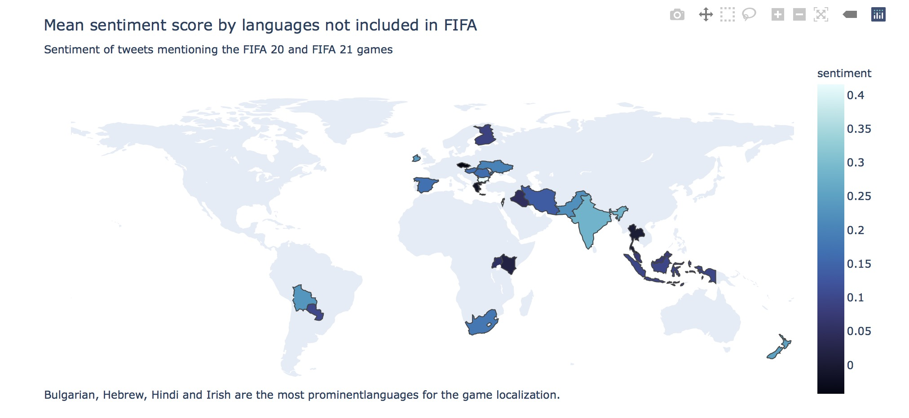

# Language localization for the FIFA videogame

__End-to-end project involving exploratory data analysis, social media analysis and natural language processing.__  

This is an end-to-end project where we aim to perform a language localization for the FIFA videogame with only public and recollected data sets. 

* __A [Medium Story](https://towardsdatascience.com/language-localization-an-end-to-end-project-on-data-science-and-fifa-20-9b467c636345) of this project was featured in the _Data Science_ and _Programming_ topic pages, and was  published in [Towards Data Science](https://towardsdatascience.com).__

* __Another [Medium Story](https://towardsdatascience.com/twitter-json-data-processing-3f353a5deac4) covering the process in `Tweets processing and sentiment.ipynb` was featured in the _Data Science_ and _Machine Learning_ topic pages, and was  published in [Towards Data Science](https://towardsdatascience.com).__

__Language localization__ is the process of adapting a product's translation to a specific country or region. It is the second phase of a larger process of product translation and cultural adaptation (for specific countries, regions, cultures or groups) to account for differences in distinct markets, a process known as internationalization and localization. 

In this project we aim to find the best possible language to which translate next versions of [Electronic Arts](https://www.ea.com)'s videogame, __FIFA__. For this, we don't have any official data but the specifications of the game and a full dataset of the attributes and skills of the players in the game. Apart from this, we also employ a collection of Twitter tweets mentioning the game and with a [sentiment](https://en.wikipedia.org/wiki/Sentiment_analysis) score. This data, however, is enough to come with an insightful conclusion about what would be a good language candidate for the future.

## Notebooks

* `FIFA_localization.ipynb`: Main notebook with the analyses. The contents include:

    0. FIFA languages included in the game
    1. The FIFA 20 dataset
        1. Adding languages to the dataset
        2. Player's international reputations
    2. Twitter analysis
        1. Tweets with coordinates (exact location)
        2. Tweets by tweet language
        3. Tweets by user location
        4. Sentiment of the top languages by international reputation
    3. Conclusions

* `Tweets processing and sentiment.ipynb`: Here we clean, process and translate the tweets and compute the sentiment. A copy of this notebook comes in a Python script in `Tweets processing and sentiment.py`.

* `Countries_dataset.ipynb`: We construct a country/language CSV dataset from several public JSON files.

`Twitter/`: This folder contains Python scripts used to collect the tweets processed in `Tweets processing and sentiment.ipynb`.

__Note:__ Please keep in mind that Twitter [does not allow](https://developer.twitter.com/en/developer-terms/more-on-restricted-use-cases) to make data obtained form their API publicly available. Therefore, some parts of the notebooks are not reproducible in Binder or Google Colab.

## Results

The results are summarized in [Plotly](https://plotly.com/python/)'s maps in the `Results/` folder.